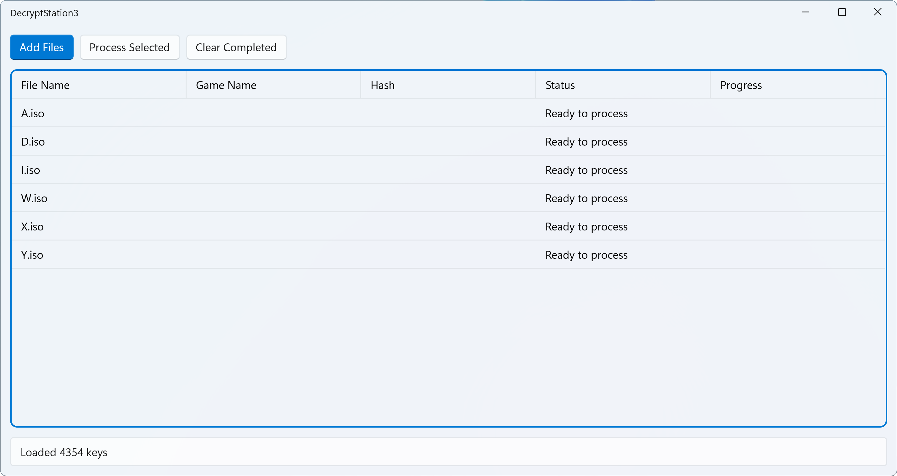
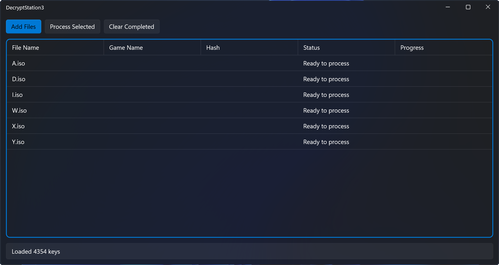

  <picture>
    <source media="(prefers-color-scheme: dark)" srcset="Assets/DS3Light.png">
    <source media="(prefers-color-scheme: light)" srcset="Assets/DS3Dark.png">
    
  </picture>

  

    
    
    
    
  

## 🎮 About

DecryptStation3 is a modern Windows application designed to decrypt PlayStation 3 game ISO files. Built with WinUI 3 and featuring a clean, modern interface, it offers a streamlined workflow for processing PS3 game backups.

## 🖼️ Screenshots

  

    <h3>🌞 Light Theme</h3>
    
  

   
  

    <h3>🌙 Dark Theme</h3>
    
  

## ✨ Features

- 🚀 **Batch Processing**: Decrypt multiple ISO files simultaneously
- 🔍 **Automatic Game Detection**: SHA1 hash calculation and matching
- 📊 **Progress Tracking**: Real-time progress monitoring for each file
- 🎯 **Smart Extraction**: Automatic content extraction after decryption
- 🎨 **Modern UI**: Clean WinUI 3 interface with Mica backdrop
- 🌙 **Theme Support**: Seamless light/dark theme integration
- 💪 **Performance**: Multi-threaded processing for optimal speed making it way faster than PS3Dec r5.

## 📋 Requirements
- Windows 10 version 1809 or higher
- [.NET 7.0 Runtime](https://dotnet.microsoft.com/download/dotnet/7.0)
- [Windows App SDK Runtime](https://learn.microsoft.com/windows/apps/windows-app-sdk/downloads)
## 🚀 Getting Started
1. Download the latest release from the [Releases](https://github.com/yourusername/DecryptStation3/releases) page
2. Install the required runtimes if not already installed
3. Launch DecryptStation3
4. On first run, you'll need to provide the game keys database:
   - Select either an existing JSON database
   - Or create one from PS3 game keys and datfile archives
## 💡 How to Use
1. Click "Add Files" to select PS3 ISO files for processing
2. Select the files you want to process
3. Click "Process Selected" to begin processing files
4. The application will automatically:
   - Calculate SHA1 hashes
   - Match games against the database
   - Display game information
5. Monitor progress in real-time
6. Find decrypted files in the same location as source files
## ⚙️ Technical Details
- Built with C# and WinUI 3
- Uses modern Windows App SDK features
- Implements efficient multi-threaded processing
- Supports parallel hash calculation and decryption
- Includes robust error handling and recovery
## ⚠️ Important Notes
- Game keys database is required but not included
- You must provide your own legal copies of games
- This tool is for backup and preservation purposes only
- Only supports legitimate game backups
## 🤝 Contributing
Contributions are welcome! Please feel free to submit a Pull Request. For major changes, please open an issue first to discuss what you would like to change.
## 📝 License
This project is licensed under the GNU General Public License v3.0 - see the [LICENSE](LICENSE) file for details.
## 📌 Disclaimer
This software is intended for use with legally obtained games only. The developers do not provide game keys or copyrighted content. Users are responsible for ensuring they have the right to use this software with their content.
